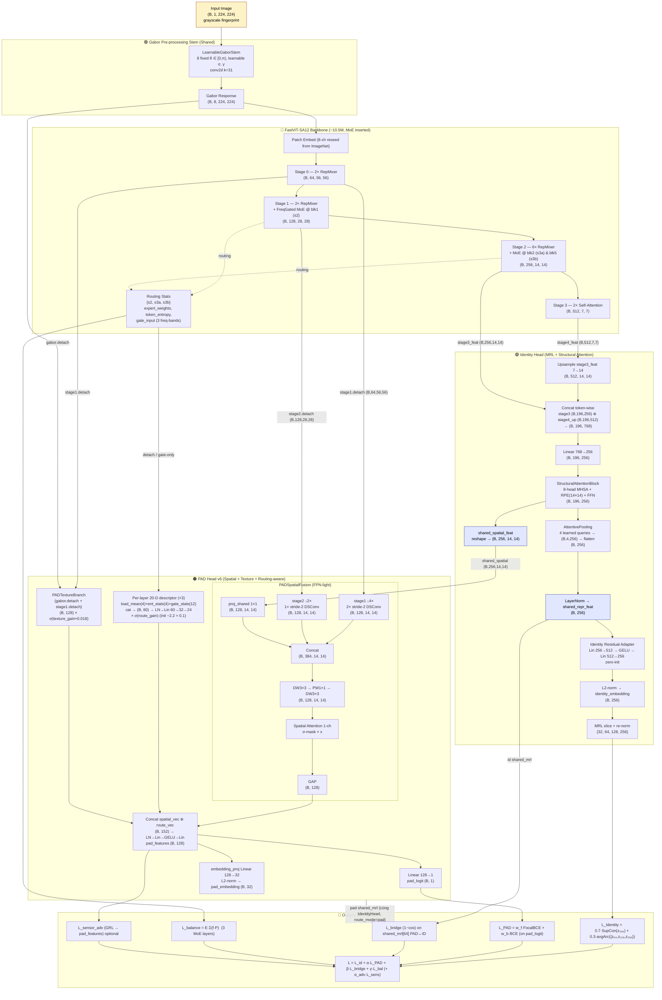

# OMFR (PAD-joint) — Phân tích Kiến trúc Chi tiết

> **Nguồn:** `omfr/models/omfr.py`, `backbone/{gabor_stem, fastvit, frequency_gate, moe_ffn, pad_stem}.py`, `heads/{identity_head, pad_head}.py`
> **Ngữ cảnh:** OMFR — Orthogonal Matryoshka Fingerprint Representation. Một mô hình duy nhất giải đồng thời (1) khớp danh tính vân tay (open-set) và (2) phát hiện tấn công trình bày (PAD / liveness).
> **Input chuẩn:** `(B, 1, 224, 224)` ảnh vân tay grayscale.

---

## 1. Tổng quan luồng dữ liệu

```
Image (B,1,224,224)
   │
   ▼
LearnableGaborStem  ─►  (B, 8, 224, 224)
   │
   ▼
FastViT-SA12 + 3× Frequency-Gated MoE (dual-router: identity / pad)
   ├── stage0: (B,  64, 56, 56)   ─────────────┐  (PAD path)
   ├── stage1: (B, 128, 28, 28)  + MoE s2  ───┤
   ├── stage2: (B, 256, 14, 14)  + MoE s3a/b ─┤
   └── stage3: (B, 512,  7,  7)   ─────────────┘
   │                                            │
   │  (Identity: stage3 + stage4)                routing_stats {s2, s3a, s3b}
   ▼
IdentityHead (Structural Attention + MRL)
   ├── shared_spatial_feat (B, 256, 14, 14)  ──► PADHead
   ├── shared_repr_feat / shared_embedding (B, 256)
   ├── shared_mrl_embeddings {32,64,128,256}
   ├── identity_embedding   (B, 256)   (residual adapter trên shared_repr)
   └── mrl_embeddings       {32,64,128,256}
   │
   ▼                                              ▼
  ArcFace × 3   +   SupCon                      PADHead v6 (Spatial + Texture + Routing)
                                                 ├── pad_features (B, 128)
                                                 ├── pad_logit    (B,   1)
                                                 └── pad_embedding(B,  32)  (Linear 128→32, độc lập)
```

Một **stem chung** + **một backbone chung** + **hai head song song**, với cơ chế ngắt gradient có chủ đích để PAD không làm hỏng identity backbone, đồng thời một *bridge loss* nhẹ giữ cho hai latent không drift quá xa.

---

## 2. Sơ đồ Mermaid (Architecture Visualization)



---

## 3. Bóc tách module (Module Breakdown)

### 3.1 LearnableGaborStem — `backbone/gabor_stem.py`
- **Mục đích:** Tăng cường ridge/valley vân tay trước khi vào ViT.
- **Cấu hình:** 8 hướng cố định trong `[0, π)`, kernel 31×31, mỗi hướng học `σ` (frequency scale) và `γ` (anisotropic bandwidth).
- **Output:** 8-channel Gabor response `(B, 8, 224, 224)`.
- Patch-conv của FastViT phải re-seed cho 8 input-ch (3 ch đầu copy từ ImageNet, 4 ch còn lại = mean + Gaussian noise nhỏ).

### 3.2 FastViT-SA12 Backbone (+ Frequency-Gated MoE) — `backbone/fastvit.py`, `moe_ffn.py`, `frequency_gate.py`
| Stage  | Block                | Output           | MoE         |
|--------|----------------------|------------------|-------------|
| 0      | RepMixer × 2         | `(B,  64, 56, 56)` | —           |
| 1      | RepMixer × 2         | `(B, 128, 28, 28)` | **s2** @ blk1 |
| 2      | RepMixer × 6         | `(B, 256, 14, 14)` | **s3a** @ blk2, **s3b** @ blk5 |
| 3      | Self-Attention × 2   | `(B, 512,  7,  7)` | —           |

- **`ConvMoEMlpWrapper`** giữ nguyên depthwise-7×7 spatial mixer của FastViT, chỉ **thay** phần pointwise expansion (`fc1/GELU/fc2`) bằng `FreqGatedMoEFFN`.
- **`FreqGatedMoEFFN`**: 4 chuyên gia, top-2 routing. Train có Noisy top-k (σ=0.3 cho identity, 0 cho PAD). Loss cân tải Switch-Transformer `E·Σ(f·P)`.
- **Dual router** (cốt lõi cho dual-task): mỗi MoE-FFN có **hai** router riêng:
  - `gate_proj` (MLP `3→16→E`) — dùng khi `route_mode="identity"`.
  - `pad_gate_proj` + low-rank `pad_router_delta` — dùng khi `route_mode="pad"`. PAD logits = `identity_anchor.detach() + σ(pad_router_blend)·(pad_gate_proj + σ(pad_router_gain)·pad_router_delta − identity_anchor)`. Cả `pad_router_gain` và `pad_router_blend` init `−2.2` (≈0.1) để PAD bắt đầu gần routing identity rồi học sai khác. `pad_gate_proj` được copy weights từ `gate_proj` lúc khởi tạo.
  - Các thống kê routing có hai bản: bản gốc (gradient theo route đang chạy) và bản `*_gateonly` re-project từ `gate_input.detach()` để PAD head có thể backprop về router mà **không** rò gradient lên `freq_gate → tokens → backbone`.
- **`FrequencyGate`**: 2D-FFT mỗi resolution (mask cache cho 28² và 14²), forced fp32 dưới AMP (cuFFT fp16 chỉ hỗ trợ POT). Output 3 dải năng lượng radial (sub-ridge / ridge / super-ridge) chuẩn hóa LayerNorm.

### 3.3 IdentityHead — `heads/identity_head.py`
| Bước                       | Input                                  | Output            |
|----------------------------|----------------------------------------|-------------------|
| Upsample stage4 7→14      | `(B, 512, 7, 7)`                       | `(B, 512, 14, 14)` |
| Reshape stage3            | `(B, 256, 14, 14)`                     | `(B, 196, 256)`   |
| Reshape stage4_up         | `(B, 512, 14, 14)`                     | `(B, 196, 512)`   |
| Concat                     | both                                   | `(B, 196, 768)`   |
| `input_proj` Linear 768→256| —                                      | `(B, 196, 256)`   |
| StructuralAttentionBlock  | MHSA(8h) + **RPE 14×14** + FFN×4       | `(B, 196, 256)`   |
| **Tách 1:** reshape spatial| —                                      | **`shared_spatial_feat` (B, 256, 14, 14)** |
| **Tách 2:** AttentivePooling| 4 learned queries                     | `(B, 256)`        |
| `final_norm` LayerNorm    | —                                      | `shared_repr_feat`|
| Identity adapter (zero-init)| residual                              | `(B, 256)`        |
| L2-norm                    | —                                      | `identity_embedding (B, 256)` |
| MRL slice + re-norm        | `[:32]`, `[:64]`, `[:128]`, `[:256]`   | dict `{32,64,128,256}` |

> **ArcFace classifier KHÔNG nằm trong head** — chúng được giữ riêng trong `nn.ModuleDict(arcface_losses)` ở `OMFRModule` để tránh duplicate weights và đơn giản hóa ONNX export.

### 3.4 PADHead v6 — `heads/pad_head.py`
**Spatial Fusion path (`PADSpatialFusion`)**
| Branch        | Input                              | Conv chain                       | Output            |
|---------------|------------------------------------|----------------------------------|-------------------|
| `proj_s1`     | `(B, 64, 56, 56)` *.detach*        | 2× stride-2 DSConv 56→14         | `(B, 128, 14, 14)` |
| `proj_s2`     | `(B, 128, 28, 28)` *.detach*       | 1× stride-2 DSConv 28→14         | `(B, 128, 14, 14)` |
| `proj_shared` | `(B, 256, 14, 14)` (shared_spatial)| 1×1 Conv                          | `(B, 128, 14, 14)` |
| Concat → fuse | `(B, 384, 14, 14)`                 | DW3×3 → PW1×1 → DW3×3 + spatial-attn σ-mask | `(B, 128, 14, 14)` |
| GAP           | —                                   | —                                | `spatial_vec (B, 128)` |

**Texture path (`PADTextureBranch`)**
| Branch        | Input                              | Conv chain                       | Output            |
|---------------|------------------------------------|----------------------------------|-------------------|
| `gabor_tower` | `(B, 8, 224, 224)` *.detach*       | 3× stride-2 Conv 224→28          | `(B, 64, 28, 28)` |
| `stage1_tower`| `(B, 64, 56, 56)` *.detach*        | 1× stride-2 Conv 56→28           | `(B, 64, 28, 28)` |
| Concat → fuse | `(B, 128, 28, 28)`                 | DW3×3 → PW1×1                    | `(B, 128, 28, 28)` |
| GAP + residual| —                                  | `spatial_vec += σ(texture_gain)·texture_vec` (`texture_gain` init −4) | `(B, 128)` |

**Routing path (auxiliary)**
- 20-D descriptor / lớp MoE: `load_mean (4) + ent_stats (4) + gate_stats (12)`.
- 3 lớp MoE → `(B, 60)` → `LayerNorm → Linear 60→32 → GELU → Linear 32→24` → nhân `σ(route_gain)` với `route_gain` init `-2.2` ≈ **0.1** (cố ý nén nhỏ để tránh sensor-shortcut).

**Fusion**
- `spatial_vec += σ(texture_gain) · texture_vec` (residual gate, init `texture_gain=−4` ⇒ ≈0.018 — texture branch khởi tạo gần như tắt).
- `concat(spatial_vec, route_vec) ∈ ℝ^{152}` → `LayerNorm → Linear 152→256 → GELU → Dropout → Linear 256→128` → `pad_features (B, 128)`.
- `pad_logit = Linear(128, 1)` cho BCE/Focal-BCE.
- `pad_embedding = L2(Linear(pad_features, 32))` — **head riêng**, không dùng lại MRL-32 của IdentityHead. Bridge loss được tính trên `shared_mrl_embeddings` của hai route (id-route vs pad-route) chứ không qua `pad_embedding`.

---

## 4. Bảng tensor shapes (Forward Pass Analysis)

| # | Module                                  | Input                               | Output                              | Ghi chú                                       |
|---|-----------------------------------------|-------------------------------------|-------------------------------------|-----------------------------------------------|
| 1 | LearnableGaborStem                      | `(B, 1, 224, 224)`                  | `(B, 8, 224, 224)`                  | 8 hướng cố định, σ/γ học                       |
| 2 | FastViT Stage 0 (RepMixer ×2)           | `(B, 8, 224, 224)`                  | `(B, 64, 56, 56)`                   | ↓4 (patch+RepMixer)                           |
| 3 | FastViT Stage 1 + MoE (s2)              | `(B, 64, 56, 56)`                   | `(B, 128, 28, 28)`                  | ↓2; MoE 4-expert top-2                        |
| 4 | FastViT Stage 2 + MoE (s3a, s3b)        | `(B, 128, 28, 28)`                  | `(B, 256, 14, 14)`                  | ↓2; **2** lớp MoE                              |
| 5 | FastViT Stage 3 (Self-Attn ×2)          | `(B, 256, 14, 14)`                  | `(B, 512, 7, 7)`                    | global attention 49 tokens                    |
| 6 | IdHead — Upsample stage4 7→14           | `(B, 512, 7, 7)`                    | `(B, 512, 14, 14)`                  | bilinear, giữ minutiae                         |
| 7 | IdHead — Concat tokens                  | `(B,196,256)+(B,196,512)`           | `(B, 196, 768)`                     | token-wise                                    |
| 8 | IdHead — `input_proj` Linear            | `(B, 196, 768)`                     | `(B, 196, 256)`                     | nén về 256-D                                  |
| 9 | IdHead — StructuralAttentionBlock       | `(B, 196, 256)`                     | `(B, 196, 256)`                     | 8 heads, RPE 14×14, FFN ×4                    |
|10 | IdHead — reshape spatial                | `(B, 196, 256)`                     | `(B, 256, 14, 14)`                  | **shared_spatial_feat** (cho PAD)             |
|11 | IdHead — AttentivePooling (4 queries)   | `(B, 196, 256)`                     | `(B, 256)`                          | flatten(4×256) → Linear(1024,256)             |
|12 | IdHead — LayerNorm + adapter            | `(B, 256)`                          | `(B, 256)`                          | identity adapter zero-init                    |
|13 | IdHead — L2-norm + MRL slice            | `(B, 256)`                          | `{32,64,128,256}`                   | identity_embedding + MRL                       |
|14 | PAD — `proj_s1` 56→14                   | `(B, 64, 56, 56) .detach`           | `(B, 128, 14, 14)`                  | 2× stride-2 DSConv                            |
|15 | PAD — `proj_s2` 28→14                   | `(B, 128, 28, 28) .detach`          | `(B, 128, 14, 14)`                  | 1× stride-2 DSConv                            |
|16 | PAD — `proj_shared` 1×1                 | `(B, 256, 14, 14)`                  | `(B, 128, 14, 14)`                  | từ shared_spatial_feat                        |
|17 | PAD — Concat                            | 3 nhánh                             | `(B, 384, 14, 14)`                  | —                                             |
|18 | PAD — DSConv refine + spatial-attn      | `(B, 384, 14, 14)`                  | `(B, 128, 14, 14)`                  | DW3 → PW1 → DW3 + σ-mask                      |
|19 | PAD — GAP                                | `(B, 128, 14, 14)`                  | `(B, 128)`                          | spatial_vec                                   |
|20 | PAD — routing 20-D × 3 → MLP            | `(B, 60)`                           | `(B, 24)`                           | × `σ(route_gain)` ≈ 0.1                        |
|21 | PAD — fusion MLP                        | `(B, 152)`                          | `(B, 128)`                          | pad_features                                  |
|22 | PAD — logit head                        | `(B, 128)`                          | `(B, 1)`                            | pad_logit                                     |
|23 | PAD — pad_embedding                     | `pad_features (B, 128)`             | `(B, 32)`                           | `Linear(128,32)` + L2-norm (head riêng)        |

---

## 5. Loss đa nhánh

| Loss               | Công thức                                                                                                | Phase ramp                              |
|--------------------|----------------------------------------------------------------------------------------------------------|-----------------------------------------|
| `L_Identity`       | `w_supcon · SupCon(z₂₅₆) + w_arc · (1/3)·Σ_{m∈{64,128,256}} ArcFace_m(z_m)` (default 0.7 / 0.3)          | Active toàn bộ; ArcFace `s` ramp 1→32→48 |
| `L_PAD`            | weighted `w_f · FocalBCE(pad_logit, y) + w_b · BCE(pad_logit, y)`; tăng weight cho `Swipe/{Latex, PlayDoh, WoodGlue}` spoof và top-k hard spoof OHEM | α: 0 → 1.0 trong Phase 2 (cosine soft-start) |
| `L_bridge`         | `mean_{d∈bridge_mrl_dims} (1 − cos(z^{shared,pad}_d, z^{shared,id}_d))` trên `shared_mrl_embeddings` của 2 route. Default `bridge_mrl_dims=[64]`. Trong Phase 2 anchor `z_id` được `.detach()`. | β: 0 → 0.02 trong Phase 2               |
| `L_balance`        | `Σ_{layer ∈ {s2,s3a,s3b}} E · Σ(f_e · P_e)` (Switch-Transformer)                                          | γ const (≈0.01–0.05); luôn active        |
| `L_sensor_adv` (opt)| `CE(SensorAdvHead(GRL_λ(pad_features)), sensor_label)`                                                   | α_adv default 0; bật khi cần debias      |

**Tổng:** `L = L_Identity + α·L_PAD + β·L_bridge + γ·L_balance (+ α_adv·L_sensor_adv)`

---

## 6. Three-Phase Training Protocol

| Phase | Epochs | Train gì                                          | Loss key                                                                              |
|-------|--------|---------------------------------------------------|---------------------------------------------------------------------------------------|
| **1** Identity Foundation | 0–19  | Gabor + backbone + IdentityHead                  | `L_Identity + γ·L_balance`. ArcFace `s/m` giữ 1.0/0.0 trong delay rồi ramp 1→32 / 0→0.5. |
| **2** PAD Integration     | 20–39 | Thêm PADHead + sensor-adv head                   | Joint step (id + pad cùng 1 optimizer step, **không** alternate `batch_idx % 2`). PAD route trong backbone là **gate-only**, mọi backbone output detach. α/β cosine soft-start. |
| **3** Joint Refinement    | 40–59 | Tất cả jointly, 3 dataset types (id / pad / joint)| Spoof samples bị mask khỏi ArcFace. β duy trì bridge.                                  |

**Cô lập gradient ở Phase 2** (cốt lõi):
- `_run_pad` → `stage1/2.detach()` và routing-stats dùng phiên bản **gate-only** (gradient chỉ chảy về `pad_gate_proj`, không ngược lên trunk).
- → backbone chỉ shape bởi identity loss; PAD loss không thể đầu độc 10.5M-param backbone bằng sensor-bias từ LivDet.

---

## 7. Đánh giá thiết kế

### Điểm mạnh
1. **Decoupled gradient by phase.** Backbone chỉ shape bởi identity loss; PAD lấy "free meal" từ representation đã học → tránh task-interference cổ điển trong multi-task.
2. **Routing-as-PAD-signal** (đóng góp cốt lõi). Cùng một MoE phục vụ expressivity (top-2 expert) và liveness cue (load distribution + entropy + gate-input). Live route đa dạng, spoof route đồng đều.
3. **Shared spatial latent (14×14)** thay vì pooled vector → PAD giữ vị trí, đúng bản chất artifact PAD là *cục bộ* (halo, edge, fake-ridge regions).
4. **MRL nesting + ArcFace ngoài head.** 256-D embedding hỗ trợ matching biến độ (64-D nhanh, 256-D chính xác). ArcFace lưu riêng → clean cho ONNX.
5. **Identity adapter zero-init** cho phép warm-start checkpoint cũ không drift đột ngột.
6. **Bridge loss (1 − cos) tại MRL-32/64** giữ hai latent gần nhau mà không cần backbone full-grad từ PAD.

### Bottleneck / rủi ro
1. **3 forward passes ở Phase 2 joint step** (id-route, pad-route, pad's id-route) — VRAM nặng trên 12 GB; đã phải hạ batch PAD 128 → 64. Có thể cache shared latent giữa các nhánh để giảm.
2. **`bridge_mrl_dims = [64]`** là điểm neo *duy nhất*; nếu MRL-64 collapse, cả ràng buộc bridge yếu đi. Cân nhắc thêm MRL-128.
3. **FFT trong FrequencyGate phải fp32** dưới AMP (cuFFT fp16 chỉ POT). Với 28² và 14² OK, nhưng đáng đo throughput thực.
4. **PADHead phụ thuộc nặng vào `shared_spatial_feat`** sau Structural Attention → bug ở IdentityHead có thể giết PAD ngầm. Tight coupling.
5. **Routing descriptor 60-D** nhỏ so với spatial 128-D, lại bị `σ(route_gain)` ≈ 0.1 nén lúc khởi tạo → spatial path có thể lấn át. **Cần monitor `route_gain` xuyên Phase 3** — nếu nó vẫn ≪ 1 sau hội tụ, claim "routing-as-PAD-signal" về bản chất chưa hoạt động.
6. **MoE balance loss** với uniform optimum = `E = 4`, không phải 0 → đọc log dễ nhầm collapse ↔ uniform.
7. **PAD preprocessing phải đồng nhất train/eval.** PAD train hiện dùng cùng miền `[0,1]` với identity/eval; không dùng normalize riêng trong `make_pad_train_transform`.

---

## 8. Tham chiếu file

| Module                  | Đường dẫn                                            |
|-------------------------|-------------------------------------------------------|
| Lightning module        | `omfr/models/omfr.py`                                |
| Gabor stem              | `omfr/models/backbone/gabor_stem.py`                 |
| PAD stem (legacy)       | `omfr/models/backbone/pad_stem.py`                   |
| FastViT backbone        | `omfr/models/backbone/fastvit.py`                    |
| Frequency-Gated MoE     | `omfr/models/backbone/moe_ffn.pdy`                    |
| Frequency-band gate     | `omfr/models/backbone/frequency_gate.py`             |
| Identity head           | `omfr/models/heads/identity_head.py`                 |
| PAD head                | `omfr/models/heads/pad_head.py`                      |
| ArcFace                 | `omfr/models/losses/arcface.py`                      |
| SupCon                  | `omfr/models/losses/supcon.py`                       |
| Focal BCE               | `omfr/models/losses/focal_bce.py`                    |
| Orthogonality           | `omfr/models/losses/orthogonal.py`                   |
| MixUp consistency       | `omfr/models/losses/mixup_consistency.py`            |
| Sensor adversarial      | `omfr/models/losses/sensor_adversarial.py`           |
| Phase scheduler         | `omfr/callbacks/phase_scheduler.py`                  |
